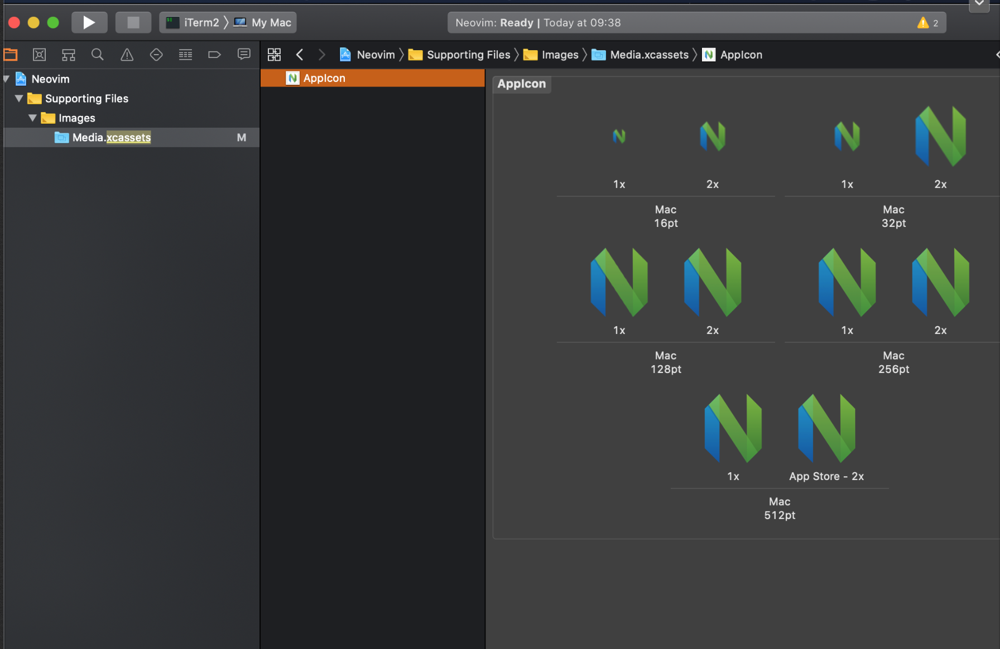

I use Neovim on OS X as my code editor.

I am quite happy to use it in the terminal, but I find it helpful to have a
separate application that I can run in full screen and can switch to
independently of iTerm2.

I tried some of the standalone Neovim applications, but was generally unhappy
with them for one reason or another. So I decided to make a standalone version
that runs inside iTerm2.


Running Neovim this way is great because it leverages the power and stability
of iTerm2. iTerm2 has great support for customization of appearance and
keyboard rebinding.

Here's how to build a standalone version of Neovim that's based on iTerm2.

I am not a developer of Mac applications, so the following is based on a bit of
trial and error and fiddling around with XCode. This is the method I've used to
build a standalone version of Neovim several times across several versions of
Neovim and XCode.

These steps have been tested with XCode 11.2.

1. Clone iTerm2 master from GitHub https://github.com/gnachman/iTerm2

2. Open XCode and choose "Open another project...". Select the directory where you cloned iTerm2.


3. Change Bundle ID to (something like) co.uk.cloudship.neovim


4. Under Signing & Capabilities change to “Sign to run locally”


5. In the right-hand pane change Name to Neovim


A window will appear helping you rename all instances of iTerm2 to Neovim.

6. Update the icons.

Find Supporting Files > Images > Media.xcassets (you can use the filter at the
bottom of the file list window)

Grab the Neovim icon from here:
https://raw.githubusercontent.com/neovim/neovim.github.io/master/logos/neovim-mark.png

I used Iconfly to generate AppIcon.appiconset (select generate without scaling).

Drag the AppIcon.appiconset folder to Xterm.

Remove the old icon set and rename the new one to the old name.



7. I tried building at this point but it failed due to a reference somewhere to iTerm2.pch.

I couldn't find where it was in the XCode interface so I opened a terminal and
searched inside files:

```
iTerm2|master⚡ ⇒ ag iTerm2.pch
Neovim.xcodeproj/project.pbxproj
14379:                          GCC_PREFIX_HEADER = sources/iTerm2.pch;
14434:                          GCC_PREFIX_HEADER = sources/iTerm2.pch;
14499:                          GCC_PREFIX_HEADER = sources/iTerm2.pch;
14553:                          GCC_PREFIX_HEADER = sources/iTerm2.pch;
```

I ran a command to change references to iTerm2.pch to Neovim.pch:
```
iTerm2|master⚡ ⇒ find . -type f -exec gsed -i "s/iTerm2.pch/Neovim.pch/" {} \;
```

At this point XCode will recognize that the files on disk have changed. You
should select the "Revert" option, which loads the project from the files in
the disk.

8. Build the application by hitting ⌘-R.

9. Copy Neovim to applications.

Under Products right click on Neovim.app and select “Show in Finder”.

Move Neovim.app to applications.


10. All done!

You should be able to run Neovim.app now.

What I did after this was create a separate profile for Neovim in iTerm2 that
runs the following at startup: `nvim && exit`. This option is under Profiles >
General as "send text at start) in the iTerm2 (and now Neovim) preferences.


